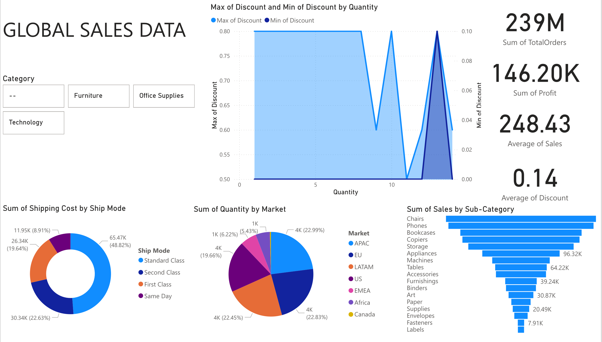
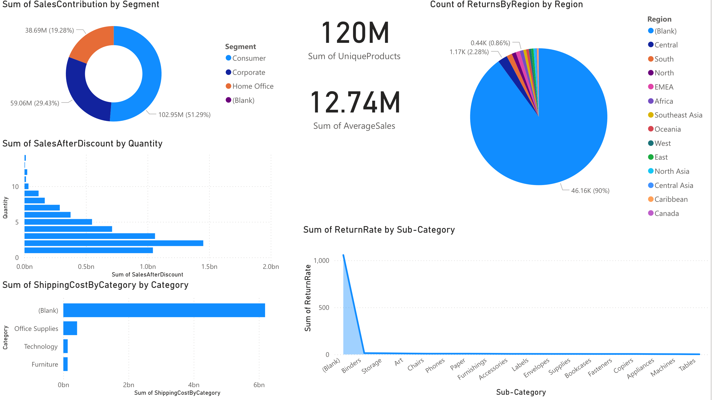

# 🌍 Global Sales Data — Power BI Dashboard

<div align="center">


**A two-page interactive Power BI dashboard analysing global retail sales across 7 markets, 3 customer segments, 4 shipping modes, and 20+ product sub-categories — built to surface discount risks, return rate patterns, and cross-market revenue intelligence.**

</div>

---

## 📌 Table of Contents

- [Problem Statement](#-problem-statement)
- [Project Overview](#-project-overview)
- [Tech Stack & Data](#-tech-stack--data)
- [Dashboard Walkthrough](#-dashboard-walkthrough)
- [Key KPIs at a Glance](#-key-kpis-at-a-glance)
- [Key Analysis Insights](#-key-analysis-insights)
- [Business Benefits](#-business-benefits)
- [Future Scope](#-future-scope)
- [Project Files](#-project-files)
- [How to Run](#-how-to-run)
- [Author](#-author)

---

## 🚨 Problem Statement

Global retail and distribution businesses operating across multiple markets, segments, and fulfilment modes face a common set of compounding challenges:

- **Discount strategies are applied inconsistently** — high maximum discounts (up to 80%) coexist with near-zero minimum discounts, with no clear visibility into how discount depth correlates with order quantity and profit impact
- **Returns are concentrated but poorly tracked** — without region-level return rate visibility, operations and supply chain teams cannot target the root causes of product return spikes
- **Revenue contribution is unequal across segments** — Consumer, Corporate, and Home Office segments contribute very differently to total sales, yet without quantified visibility, marketing and sales resources are allocated based on assumption rather than data
- **Shipping cost is opaque across categories** — the relationship between product category, shipping mode, and cost-to-serve is not transparent enough to drive logistics optimisation decisions
- **Sub-category performance is unmonitored** — with 20+ sub-categories ranging from Chairs (highest sales) to Labels (lowest), there is no at-a-glance view of where revenue is concentrated and where long-tail products are draining resources

> **Goal:** Build a comprehensive, two-page Power BI dashboard for Global Stores Data that quantifies sales, profit, discount behaviour, return rates, shipping costs, and segment contribution across all markets — giving leadership and operations teams the intelligence to act on global retail performance with confidence.

---

## 🔍 Project Overview

This project delivers a **two-page Power BI dashboard** covering global retail operations across **7 international markets** (APAC, EU, LATAM, US, EMEA, Africa, Canada), **3 customer segments** (Consumer, Corporate, Home Office), and **4 shipping modes** (Standard Class, Second Class, First Class, Same Day).

The dashboard is split across two purpose-built analytical pages:

| Page | Title | Focus |
|---|---|---|
| **1** | Global Sales Overview | KPIs · Discount analysis · Shipping cost by mode · Market quantity share · Sub-category sales ranking |
| **2** | Segment, Returns & Discount Deep Dive | Segment revenue contribution · Sales after discount by quantity · Shipping cost by category · Returns by region · Return rate by sub-category |

**What this project demonstrates:**
- Multi-dimensional global retail analysis across markets, segments, categories, and geographies
- Discount behaviour modelling — max vs. min discount patterns across order quantities
- Return rate analysis at both regional and sub-category level
- End-to-end Power BI development: data modelling → DAX measures → executive reporting
- Business-focused design serving both strategic (leadership) and operational (logistics, category) audiences

---

## 🚀 Tech Stack & Data

| Layer | Tool / Source |
|---|---|
| **BI & Visualisation** | Microsoft Power BI Desktop |
| **Calculations** | DAX (Data Analysis Expressions) |
| **Data Source** | Global Stores / Global Superstore dataset |

---

## 📋 Dashboard Walkthrough

### Page 1 — Global Sales Overview



The landing page delivers four headline KPI cards, a category filter slicer, and three core visualisations covering discount behaviour, shipping cost distribution, market quantity share, and sub-category sales ranking.

---

**🔢 Headline KPI Cards (Top Right)**

| KPI | Value |
|---|---|
| **Sum of Total Orders** | **239M** |
| **Sum of Profit** | **146.20K** |
| **Average of Sales** | **248.43** |
| **Average of Discount** | **0.14** |

A total order volume of **239M** against a profit of only **146.20K** and an average discount of **0.14 (14%)** immediately flags that the business is operating on very thin margins — high revenue, heavily compressed profit. This ratio is one of the most important strategic signals in the entire dashboard.

---

**📊 Area Chart — Max & Min of Discount by Quantity**

The dual-axis area chart plots **Max of Discount** (left axis, light blue — ranging 0.50 to 0.80) against **Min of Discount** (right axis, dark blue — ranging 0.00 to 0.10) across order quantities (0–12+). Key observations:

- **Maximum discount reaches 0.80 (80%)** for low-quantity orders (quantities 1–9), holding flat at a very aggressive level across most of the quantity range
- **At quantity ~10, max discount drops sharply to ~0.60**, before recovering briefly and then collapsing to near zero at the highest quantities
- **Minimum discount spikes at quantity ~12** to ~0.10, then disappears — suggesting bulk buyers sometimes receive a small minimum floor discount rather than zero
- This pattern reveals that the **deepest discounting happens on small, low-quantity orders** — the opposite of an incentivised bulk-buy strategy, representing a structural margin risk

---

**🍩 Donut Chart — Sum of Shipping Cost by Ship Mode**

| Ship Mode | Shipping Cost | Share |
|---|---|---|
| **Standard Class** | **65.47K** | **48.82%** |
| **Second Class** | 30.34K | 22.63% |
| **First Class** | 26.34K | 19.64% |
| **Same Day** | 11.95K | 8.91% |

Standard Class dominates at nearly half of all shipping cost spend. Same Day, despite being the highest cost-per-shipment mode, contributes the smallest share — indicating it is used sparingly. The cost distribution broadly aligns with expected usage frequency patterns.

---

**🥧 Pie Chart — Sum of Quantity by Market**

| Market | Quantity Share |
|---|---|
| **APAC** | **22.99%** |
| **EU** | 22.83% |
| **US** | 22.45% |
| **LATAM** | 19.66% |
| **Africa** | 6.22% |
| **EMEA** | 5.43% |
| **Canada** | 1K (smallest slice) |

The top three markets — APAC, EU, and US — are near-perfectly balanced at ~22–23% each, together accounting for ~68% of total quantity. LATAM contributes a meaningful ~20%, while Africa, EMEA, and Canada represent smaller, potentially high-growth opportunity markets.

---

**📊 Bar Chart — Sum of Sales by Sub-Category**

The horizontal bar chart ranks all 20+ sub-categories from highest to lowest sales:

| Rank | Sub-Category | Approx. Sales |
|---|---|---|
| 🥇 1 | **Chairs** | Highest |
| 🥈 2 | **Phones** | Very close to Chairs |
| 🥉 3 | **Bookcases** | |
| 4 | Copiers | |
| 5 | Storage | 96.32K |
| 6 | Appliances | |
| 7 | Machines | 64.22K |
| 8 | Tables | |
| 9 | Accessories | 39.24K |
| 10 | Furnishings | |
| 11 | Binders | 30.87K |
| 12 | Art | |
| 13 | Paper | 20.49K |
| 14 | Supplies | |
| 15 | Envelopes | |
| 16 | Fasteners | 7.91K |
| 17 | **Labels** | Lowest |

**Chairs and Phones dominate revenue** — the top 2 sub-categories likely represent a disproportionate share of total sales. The long tail of low-value sub-categories (Fasteners, Labels, Envelopes) may be candidates for portfolio rationalisation.

---

### Page 2 — Segment, Returns & Discount Deep Dive



The second page drills into customer segment revenue contribution, sales-after-discount behaviour, shipping cost by category, return rate by sub-category, and geographic return distribution.

---

**🔢 Page 2 Headline KPIs**

| KPI | Value |
|---|---|
| **Sum of Unique Products** | **120M** |
| **Sum of Average Sales** | **12.74M** |

---

**🍩 Donut Chart — Sum of Sales Contribution by Segment**

| Segment | Sales Contribution | Share |
|---|---|---|
| **Consumer** | **102.95M** | **51.29%** |
| **Corporate** | 59.06M | 29.43% |
| **Home Office** | 38.69M | 19.28% |

Consumer segment accounts for over half of all sales — making it the most critical segment for revenue protection. Home Office, while smallest, may represent a higher-margin opportunity given the typically lower volume but potentially higher per-order value.

---

**📊 Bar Chart — Sum of Sales After Discount by Quantity**

A horizontal bar chart showing post-discount sales value across quantity tiers (1 through 12+):

- **Quantity 1 orders generate the highest Sales After Discount** — reaching close to **1.5bn** — reflecting the sheer volume of single-unit purchases globally
- Sales after discount decline progressively as quantity increases, reflecting both fewer high-quantity orders and the structural heavy discounting on small orders identified in Page 1
- This chart confirms that **the business's revenue base is driven by small, high-frequency, individually discounted transactions** rather than bulk orders

---

**📊 Bar Chart — Sum of Shipping Cost by Category**

| Category | Shipping Cost |
|---|---|
| **(Blank)** | ~5.5bn (largest — data quality flag) |
| **Office Supplies** | ~0.5bn |
| **Technology** | Small |
| **Furniture** | Smallest |

The dominant "(Blank)" category bar is a significant **data quality signal** — a large portion of shipping cost records are not categorised. This should be investigated and resolved before using shipping cost data for strategic decisions.

---

**🥧 Pie Chart — Count of Returns by Region**

| Region | Count | Share |
|---|---|---|
| **(Blank)** | **46.16K** | **90%** |
| North Asia | 1.17K | 2.28% |
| Canada | 0.44K | 0.86% |
| Central, South, North, EMEA, Africa, Southeast Asia, Oceania, West, East, Central Asia, Caribbean | Small slices | <1% each |

The **90% blank returns attribution** is the most critical data quality finding in the dashboard. Without regional attribution for the vast majority of returns, it is impossible to identify which markets or logistics routes are driving returns. Resolving this data gap is a top analytical priority.

---

**📉 Area Chart — Sum of Return Rate by Sub-Category**

The return rate area chart shows a dramatic concentration pattern:

- **Binders** show an extraordinarily high return rate spike (~1,000+) — far exceeding every other sub-category combined
- **Storage** has the second-highest return rate, but significantly lower than Binders
- All other sub-categories — Art, Chairs, Phones, Paper, Furnishings, Accessories, Labels, Envelopes, Supplies, Bookcases, Fasteners, Copiers, Appliances, Machines, Tables — show near-zero return rates
- This concentration strongly suggests either a **product quality issue with Binders**, a **data classification problem**, or a fulfilment/packaging defect specific to this sub-category

---

## 📈 Key KPIs at a Glance

| KPI | Value | Strategic Signal |
|---|---|---|
| **Sum of Total Orders** | **239M** | Massive global transaction volume |
| **Sum of Profit** | **146.20K** | Extremely thin profit vs. order volume — margin compression risk |
| **Average of Sales** | **248.43** | Mid-range average transaction value |
| **Average of Discount** | **0.14 (14%)** | Meaningful discount depth eroding margins across all orders |
| **Sum of Unique Products** | **120M** | Very broad SKU exposure |
| **Sum of Average Sales** | **12.74M** | Strong total revenue base |

---

## 💡 Key Analysis Insights

### 1. Margins are Under Severe Pressure from Aggressive Discounting
The business offers **maximum discounts of up to 80%** on low-quantity orders — the orders that make up the vast majority of transaction volume. With an average discount of 14% across all orders, the gap between gross revenue (239M orders) and profit (146.20K) reflects systemic margin erosion from a discounting strategy that has no apparent volume incentive logic.

### 2. Small-Order Discounting is Structurally Backwards
The area chart on Page 1 reveals that **the largest discounts are concentrated at the lowest quantities**. Standard discount strategy rewards bulk purchases with deeper discounts. Here, the opposite appears true — small orders are getting the steepest discounts, which undermines both margin and the incentive for customers to buy in larger quantities.

### 3. Three Markets Are Essentially Equal in Size — An Unusual Balance
APAC (22.99%), EU (22.83%), and US (22.45%) are within 0.54 percentage points of each other in quantity share. This near-perfect three-way balance is atypical for global retailers, where one or two markets typically dominate. It suggests deliberate international diversification — but also means no single market can be deprioritised without material impact.

### 4. Consumer Segment Owns Half the Business
At **51.29% of sales contribution (102.95M)**, the Consumer segment is the single most critical revenue source. Corporate (29.43%) and Home Office (19.28%) are meaningful but secondary. Any pricing, product, or fulfilment changes must be stress-tested against their impact on Consumer segment retention first.

### 5. Chairs and Phones are the Revenue Engine
Of 20+ sub-categories, **Chairs and Phones top the sales ranking** by a significant margin. These two sub-categories — one Furniture, one Technology — represent the portfolio's highest-value SKUs and merit dedicated inventory protection, pricing attention, and promotional investment.

### 6. Binders Have an Anomalously High Return Rate
The return rate chart shows **Binders spiking to ~1,000** — a value that dwarfs every other sub-category. This is either a genuine product quality or fulfilment issue, or a data classification anomaly. Either way, it requires immediate investigation — if real, it represents a significant cost centre in reverse logistics and customer satisfaction.

### 7. 90% of Returns Lack Regional Attribution — A Critical Data Gap
The returns-by-region pie chart shows **90% of return records have no regional tag**. This makes it impossible to identify which markets, warehouses, or routes are generating returns. Fixing this data gap is a prerequisite to any meaningful supply chain or returns reduction programme.

### 8. Standard Class Shipping Absorbs Nearly Half of All Shipping Cost
At **48.82% of total shipping cost**, Standard Class is the workhorse shipping mode. Optimising this single mode — through carrier contract renegotiation, route consolidation, or order batching — would have the highest leverage on the overall logistics cost base.

---

## 💼 Business Benefits

| Benefit | Impact |
|---|---|
| **Global Revenue Visibility** | Single dashboard covers 7 markets, 3 segments, 4 ship modes, and 20+ sub-categories — replacing fragmented regional reporting |
| **Discount Strategy Audit** | Exposes the inverted discount logic (small orders getting biggest discounts) that is silently compressing margins on the highest-volume transactions |
| **Return Rate Early Warning** | Binder sub-category return rate spike is surfaced immediately — without this dashboard it could go unnoticed for months |
| **Segment Investment Clarity** | Consumer segment's 51% share quantifies where retention investment delivers the highest revenue protection |
| **Logistics Cost Optimisation** | Shipping cost by mode and category breakdown identifies where the highest cost-reduction leverage exists |
| **Data Quality Flags** | Both the Blank shipping cost category and the 90% unattributed returns are surfaced visually — prompting corrective data governance action |
| **Market Portfolio Balance** | Near-equal APAC/EU/US quantity shares visible at a glance — supporting balanced international resource allocation decisions |

---

## 🔮 Future Scope

This dashboard is a strong global retail analytics foundation. Here is how it can evolve into a production-grade intelligence platform:

### 🔧 Technical Enhancements

- **Live Data Pipeline** — Connect Power BI to a cloud data warehouse (Azure Synapse, Snowflake, Google BigQuery) for automated daily refresh across all 7 markets, replacing static dataset uploads
- **Advanced DAX Measures** — Add Gross Margin % per sub-category, Discount Impact on Profit (revenue delta between actual price and pre-discount price), Customer Lifetime Value by segment, and Return Cost Estimate (return rate × average order value)
- **Row-Level Security (RLS)** — Implement market-level and segment-level security so regional VP's and segment managers see only their own data in a shared Power BI Service workspace
- **Data Quality Monitoring Page** — Add a dedicated third page flagging blank/null records in shipping cost category, return region, and discount fields — turning data quality from a buried insight into an explicit, actionable dashboard section
- **Drill-Through Pages** — Enable click-through from the sub-category bar chart to a product-level detail page showing individual SKU performance, return rates, and margin data

### 📊 Analytics Extensions

- **Profitability Analysis** — Layer in cost-of-goods-sold data to calculate actual gross margin per sub-category and market — moving from revenue and profit sum reporting to margin rate intelligence
- **Discount Elasticity Modelling** — Build a DAX-powered sensitivity analysis showing how reducing average discount from 14% to 10% or 8% would impact profit — quantifying the margin recovery opportunity from the inverted discounting finding
- **Return Rate Predictive Model** — Connect Python/R to Power BI to build a classification model predicting which sub-categories, markets, and order sizes have the highest return probability — enabling proactive fulfilment and quality controls
- **Customer Segmentation (RFM)** — Apply Recency, Frequency, Monetary analysis to Consumer, Corporate, and Home Office segments to identify VIP accounts, at-risk buyers, and lapsed customers within each segment
- **Time-Series Revenue Forecasting** — Add a date dimension and historical trend line to project forward monthly revenue by market and channel using Power BI's native forecasting or an integrated ML model

### 🏢 Business & Integration Extensions

- **ERP / CRM Integration** — Connect to SAP, Salesforce, or Microsoft Dynamics to enrich the sales data with account manager, deal stage, and customer contract information — building a unified commercial intelligence layer
- **Returns Management Integration** — Link the return rate data to a reverse logistics platform (e.g., Happy Returns, Loop) to close the loop between the return rate spike (Binders) and the actual resolution workflow
- **Supply Chain Risk Layer** — Add supplier concentration data to the sub-category analysis — Chairs and Phones being the top revenue drivers means a supplier disruption in either would be a significant revenue event; surfacing this risk proactively is high value
- **Executive Mobile Dashboard** — Design a Power BI mobile layout with KPI cards and top-line market share visuals so C-suite stakeholders can review global performance from their phones between meetings
- **Cross-Domain Reuse** — The multi-market, multi-segment, return-rate, and discount-behaviour analytical framework built here is directly applicable to e-commerce platforms, pharmaceutical distribution, B2B wholesale, and consumer electronics retail datasets with minimal structural changes

---

## 📂 Project Files

```
GlobalStoresData-Dashboard/
│
├── GlobalSalesData.pbix                              # Main Power BI report file
│
├── Dashboard-Screenshots/
│   └── Page-1.png                         # Page 1 — Global Sales Overview
│   └── Page-2.png                         # Page 2 — Segment, Returns & Discount Deep Dive
├── GlobalStoresData-Doc.docx                         # Analysis Report
│
└── README.md                                         # This file
```

---

## ▶️ How to Run

### Prerequisites
- [Power BI Desktop](https://powerbi.microsoft.com/desktop/) — free download, Windows only
- Source dataset CSV from the `data/` folder

### Steps

```bash
# 1. Clone this repository
git clone https://github.com/yanshiSharma/GlobalStoresData-Dashboard.git
cd GlobalStoresData-Dashboard

# 2. Open Power BI Desktop

# 3. Open the report file
#    File → Open Report → select GlobalSalesData.pbix

# 4. Update the data source path if prompted
#    Home → Transform Data → Data Source Settings
#    Update the file path to point to your local data/ folder

# 5. Click Refresh on the Home ribbon to reload data

# 6. Explore the two pages using the tabs at the bottom
#    Page 1: Use the Category slicer (Furniture / Office Supplies / Technology / --)
#            to filter all visuals interactively
#    Page 2: Review segment contribution, return rates, and shipping cost by category
```

### Publish to Power BI Service (Optional)

```
1. Sign in to Power BI Desktop with a Microsoft work or school account
2. Home → Publish → select your target workspace
3. Access the live report at https://app.powerbi.com
4. Set up scheduled refresh under Dataset Settings
```

---

## 👩‍💻 Author

**Yanshi Sharma**

[](https://linkedin.com/in/yanshi-sharma)
[](https://github.com/yanshiSharma)

> *Open to Data Analyst, Business Intelligence Analyst, and Reporting Analyst roles. Feel free to connect!*

---

<div align="center">

⭐ **If you found this project useful, please give it a star!** ⭐

*Built with Power BI · DAX · Global Superstore Data · 7 Markets · 3 Segments · 20+ Sub-Categories*

</div>
